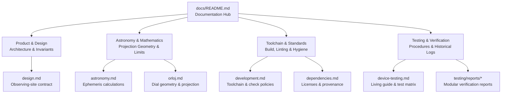

# Astronomical Clocks Wallpaper Documentation Hub

This directory contains architectural specifications, mathematical and astronomical references, development policies, and verification records for the Astronomical Clocks Wallpaper project.

The documentation is organized following the [Diátaxis framework](https://diataxis.fr/) into distinct documentation roles:

---

## 1. Product & Architecture

Documents defining the product contract, requirements, and domain invariants:

- [**Product Design & Observing-Site Contract**](design.md) (`design.md`):
  Authoritative product scope, offline autonomy principles, and the single-instant / observing-site contract (one geographic site anchoring both civil time and sky projections).

---

## 2. Astronomy & Mathematics Reference

Authoritative mathematical specifications, coordinate frames, and projection geometry:

- [**Astronomy Calculations & Implementation Limits**](astronomy.md) (`astronomy.md`):
  Ephemeris calculations, Astronomy Engine integration, coordinate systems (ecliptic coordinates of date, apparent coordinates), Delta-T models, and calculation bounds.
- [**Orloj Dial Geometry & Astrolabe Mathematics**](orloj.md) (`orloj.md`):
  Stereographic astrolabe projection mathematics, northern and southern hemisphere dial plates, horizon curves, unequal daylight hour arcs, 24-hour civil scale, zodiac ring eccentric construction, and palette contrast rules.

---

## 3. Toolchain & Engineering Standards

Environment configuration, pinned toolchain versions, and dependency governance:

- [**Development Setup, Checking Policy & Artifacts**](development.md) (`development.md`):
  Pinned toolchain (JDK, Gradle, AGP, Kotlin, Android SDK), strict checking policy (`allWarningsAsErrors = true`, detekt, ktlint, Android Lint), justified rule exceptions, and APK verification.
- [**Dependency Hygiene, Licenses & Provenance**](dependencies.md) (`dependencies.md`):
  Complete provenance and licensing records for external dependencies (Astronomy Engine), license compatibility requirements, and dependency hygiene rules.

---

## 4. Testing & Verification

Reusable procedures, diagnostic commands, acceptance test matrices, and immutable historical verification evidence:

- [**Physical-Device Testing Guide**](device-testing.md) (`device-testing.md`):
  Living canonical guide covering device privacy policies, ADB wireless and USB connections, install and launch procedures, state diagnostic commands, lifecycle state transitions, virtual time manipulation (`DEBUG_SET_TIME`), automated smoke testing (`scripts/device-smoke-test.py`), and the categorized Standard Acceptance Test Matrix.
- [**Verification Reports Directory**](testing/reports/) (`testing/reports/`):
  Directory containing discrete, immutable historical verification reports indexed chronologically by date and feature slice:
  - [2026-09-07 Repository Bootstrap](testing/reports/2026-09-07-bootstrap.md)
  - [2026-09-28 Device Feasibility & Initial Render (#2, #19)](testing/reports/2026-09-28-feat-2-device-feasibility.md)
  - [2026-09-29 Location Slice & Coordinate Locale (#3)](testing/reports/2026-09-29-feat-3-location-slice.md)
  - [2026-09-30 Saved-Site Timezone & Coordinate Precision (#24)](testing/reports/2026-09-30-feat-24-site-timezone.md)
  - [2026-10-01 Orloj 24-Hour Foundation (#4, #5)](testing/reports/2026-10-01-feat-4-orloj-foundation.md)
  - [2026-10-02 Southern Plate & Sun Layer (#4, #5)](testing/reports/2026-10-02-feat-4-southern-plate.md)
  - [2026-10-02 Dial Caching & Error Containment (#39)](testing/reports/2026-10-02-perf-39-dial-caching.md)
  - [2026-10-02 Unchanged Save Provenance & Zone Retention (#42)](testing/reports/2026-10-02-fix-42-unchanged-save.md)
  - [2026-10-03 Zodiac Compartments & Vernal Equinox Star (#43)](testing/reports/2026-10-03-feat-43-zodiac-compartments.md)
  - [2026-10-03 Sun Marker & ERFA Ephemeris Verification (#27)](testing/reports/2026-10-03-feat-27-sun-marker.md)
  - [2026-10-03 Zodiac Hardening (#74)](testing/reports/2026-10-03-refactor-74-zodiac-hardening.md)
  - [2026-10-04 Moon Marker & Phase Terminator (#28)](testing/reports/2026-10-04-feat-28-moon-marker.md)
  - [2026-10-04 Geographic Timezone & Searchable Picker (#21, #24)](testing/reports/2026-10-04-feat-21-geographic-timezone.md)
  - [2026-10-04 Virtual Time Travel & Smoke Harness (#6)](testing/reports/2026-10-04-feat-6-virtual-time-smoke.md)
  - [2026-10-04 Appearance Themes & Night Mode (#31)](testing/reports/2026-10-04-feat-31-appearance.md)
  - [2026-10-05 Pure-Read Location Storage & Startup Migration (#35)](testing/reports/2026-10-05-refactor-35-pure-location-store.md)
  - [2026-10-05 Location Permission Recovery (#3)](testing/reports/2026-10-05-fix-3-permission-recovery.md)
  - [2026-10-06 Force-Stop vs Process-Recreation Lifecycle (#36)](testing/reports/2026-10-06-docs-36-force-stop-lifecycle.md)
